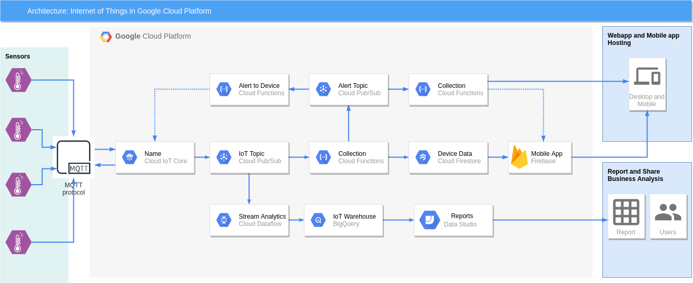

# IOT Water Management System

## Introduction
### The device simulators can be hosted in any virtual machine
Following components are used
* Docker
* Docker Compose
* Python IoT Client

### The IoT Processing is managed in Google Cloud Platform
Following components are used
* IoT Core
* Pub/Sub
* Dataflow
* BigQuery
* Data Studio
* Cloud Function
* Cloud Firestore

## Architecture

## Pre-requisites

### Create Service Account
1. Create GCP Project
2. Create the Service Account
3. Assign the Editor role to the service account on the desired project
4. Create and download the key of the service account and rename it as terraform-key.json

### Create database in Firestore
1. Go to Firestore
2. Select Native Mode
3. Select a Location (e.g. United States)
4. Click on "Create Database"

### Clone the Repository
1. Clone the repository containing the code and the configuration files
2. Switch to the terraform directory
3. Copy the terrform.tfvars.example file to terraform.tfvars 
4. Replace the value of the project variables with your own values
5. Upload and move the terraform-key.json to the terraform directory

### Create infrastructure using Terraform
Execute the follwing commands using gcloud CLI or cloud shell.
1. `export GOOGLE_CLOUD_KEYFILE_JSON=terraform-key.json`
2. `terraform init`
3. `terraform plan`
4. `terraform apply`

